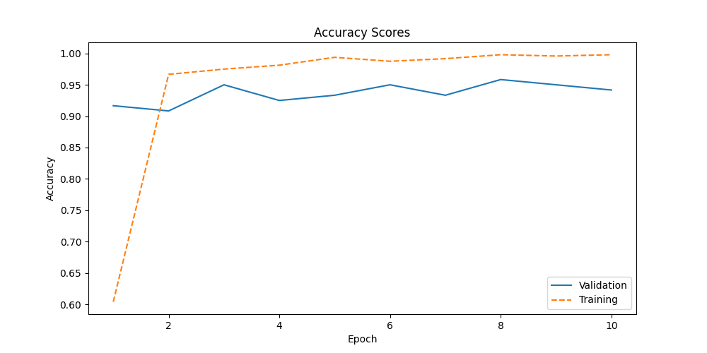

# Vision Transformer for Flower Classification

The dataset used in this project is a custom subset of the [Oxford 102 Flowers dataset](https://paperswithcode.com/dataset/oxford-102-flower). `load_data.ipynb` loads the data using [Tensorflow](https://www.tensorflow.org/datasets/catalog/oxford_flowers102), size and split of the dataset can be defined in the notebook, images are then saved locally to be used in `flower_classification.ipynb` with torch.

The notebook `flower_classification` first preprocesses and explores the data. A [Visual Transformer](https://arxiv.org/abs/2010.11929) pretrained on ImageNet-21k ([Google's ViT-small](https://github.com/google-research/vision_transformer?tab=readme-ov-file#available-vit-models), 22M parameters) is finetuned on the dataset to achieve an accuracy of around 95% on the test dataset. Hyperparameters have been tuned based loosely on this [paper](https://openreview.net/pdf?id=4nPswr1KcP).

SGD is used as an optimizer with a momentum of 0.9 and begins with a learning rate of 0.001. The learning rate is then decayed with a cosine schedule incorporating warm starts.

